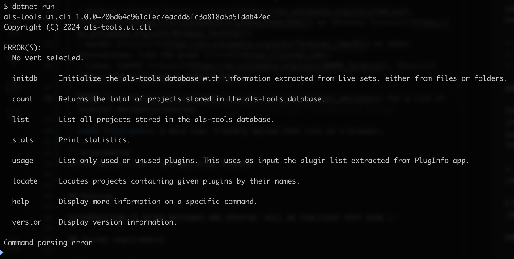
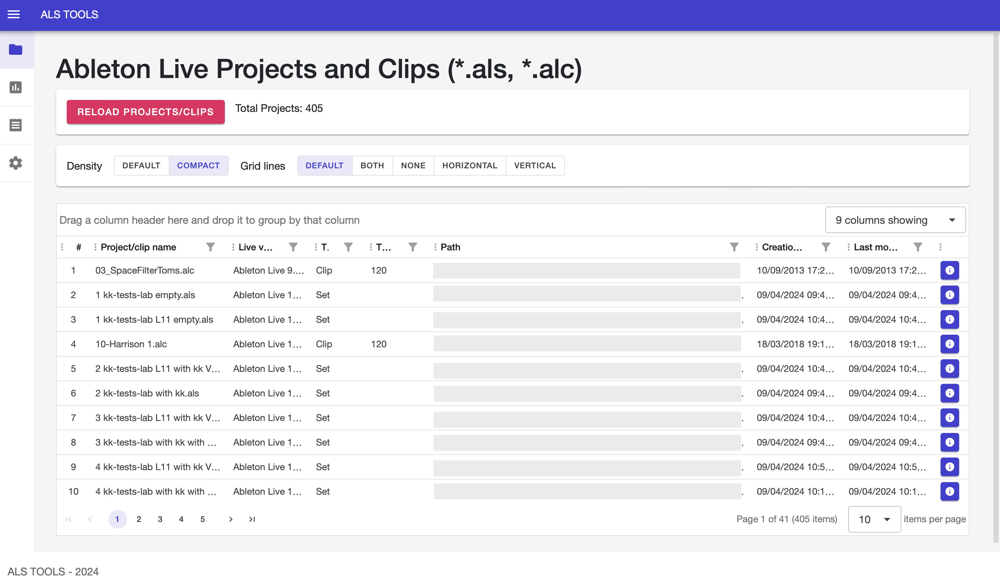
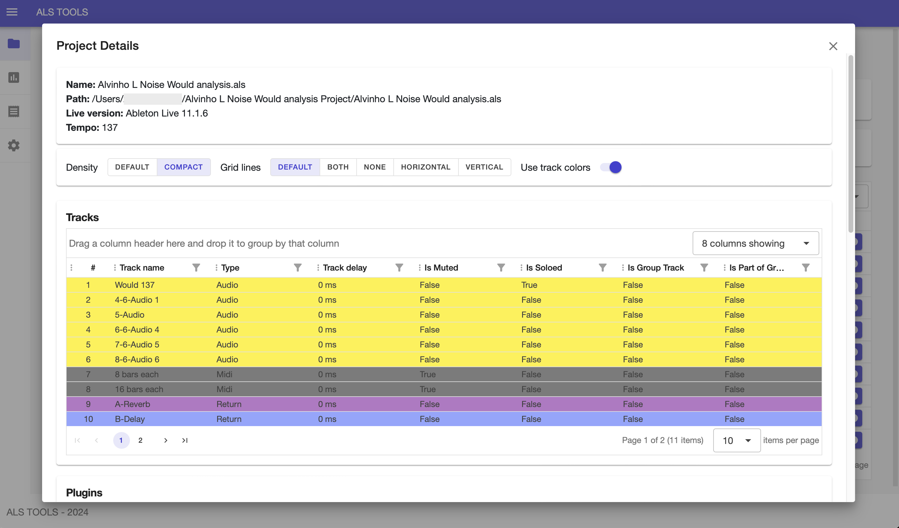
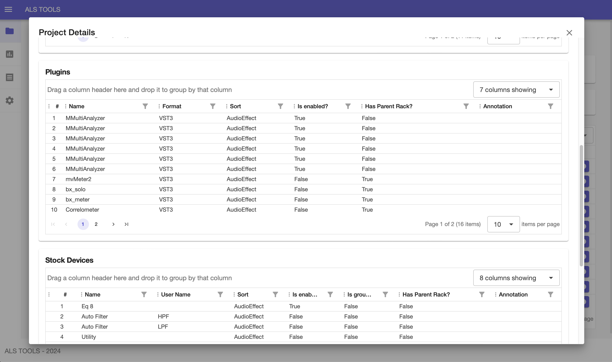
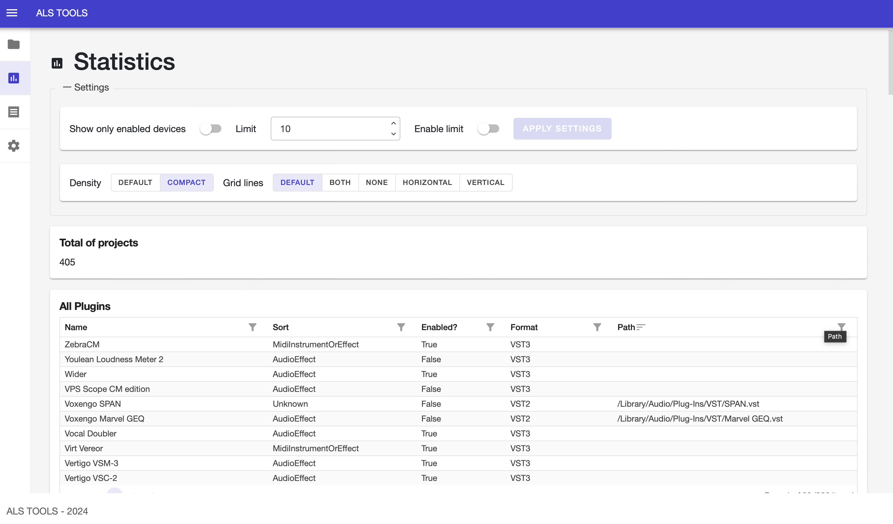
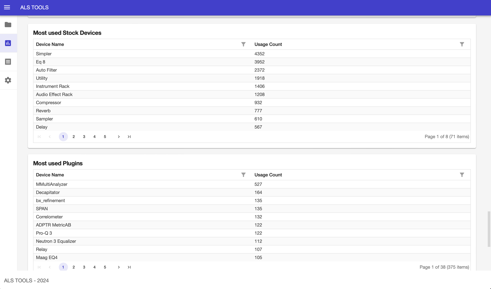

# Ableton Live Set tools

## Introduction

Ableton Live Set tools, or simply als-tools, brings easy-to-use search, listing, counting and many other capabilities over your Ableton Live Set (\*.als) and Live Clip (\*.alc) files.

> Notice: from now on, for simplicity reasons, the term **project** will be used in place of **Ableton Live set / clip**.

## Current features

- Scan multiple folders for \*.als and \*.alc files, extract data from these files and save them in a local database.
- List all projects stored in the database.
- Count the number of projects stored in the database.
- Locate projects containing one or more plugins, by plugin name (CLI only yet).
- [CLI](#console-cli) and [Web front-end](#web-front-end).
- [Statistics](#statistics)

## Future enhancements

Some of the future enhancements are:

- **[Same DB data for both CLI and WEB front-ends](https://github.com/luizen/als-tools/issues/58)**: no matter what front-end you choose, the same data will be available for both, so that one can use different front-ends interchangeably.
- **[Interactive command line](https://github.com/luizen/als-tools/issues/7)**: navigate the options using a textual menu directly in your terminal. Take a look at [this project](https://github.com/shibayan/Sharprompt) for examples.
- Statistics 2.0: not only text/tables, but also charts.
- **[Powerful search/filtering](https://github.com/luizen/als-tools/issues/10)**: it will be possible to locate and filter projects by several properties, like plugin names, plugin types, device names, track names, track types, track count, etc.

For the complete (and ever growing) list of planned, future enhancements, please visit the [Issues](https://github.com/luizen/als-tools/issues) page.

## Front-end options

This application  has two front-ends to interact with. You can choose how to interact with whatver your preference is:

### Console (CLI)

This means that commands are required to be run in a command-line interpreter / terminal emulator. Some examples:

- Windows: [Command Prompt (cmd.exe)](https://en.wikipedia.org/wiki/Cmd.exe), [PowerShell](https://en.wikipedia.org/wiki/PowerShell) or [Windows Terminal](https://en.wikipedia.org/wiki/Windows_Terminal);
- macOS: [Terminal](https://en.wikipedia.org/wiki/Terminal_(macOS)) or other alternatives, like the great [iTerm2](https://iterm2.com);
- Linux: [GNOME Terminal](https://en.wikipedia.org/wiki/GNOME_Terminal), [Konsole](https://en.wikipedia.org/wiki/Konsole);

  Click [here](https://en.wikipedia.org/wiki/List_of_terminal_emulators) for a list of terminal emulators/consoles.



### Web front-end

A more user friendly option that runs on a browser.

#### Projects list

  

#### Project details

  
  
  
#### Statistics

  
  
  
## Building and running

> Right now there aren't any platform-specific full package, binary releases (Windows, macOS, Linux). So the way to run the tool is to download its source-code, build it and run it yourself. Check the [Development dependencies section](#development-dependencies) for more details. A [github issue (#21)](https://github.com/luizen/als-tools/issues/21) has already been created to handle this as a future enhancement.

### CLI

1. In the terminal, `cd` to the place where the `src/als-tools.ui.cli` folder is, under the place where the repository has been cloned/downloaded. Example:

    ```shell
    cd ~/Downloads/als-tools/src/als-tools.ui.cli
    ```

2. Build the project by executing:

    ```shell
    dotnet build
    ```

3. Initialize the database with data extracted from Live sets (\*.als) and clips (\*.alc) files.

    Suppose your projects are under `/Users/myuser/Music/My Live Projects` and `/Users/myuser/Splice`, the following command ❗must be executed first❗ so that it:
    a) scans all projects, extracting project information plus their details (project details, its tracks, plugins, devices, etc) and
    b) loads them into the application database for further analysis.

    ```shell
    dotnet run initdb --folders "/Users/myuser/Music/My Live Projects" "/Users/myuser/Splice"
    ```

4. After the database is initialized, further commands can be executed.

    To count how many projects the database is loaded with:

    ```shell
    dotnet run count
    ```

    To list all projects (in JSON format), its plugins, devices and tracks:

    ```shell
    dotnet run list
    ```

    To locate all projects containing at least one of the plugins (*contains plugin name*):

    ```shell
    dotnet run locate --plugin-names plugin1 "plugin 2" [...]
    ```

    > Where **plugin1** and **"plugin 2"**, etc, should be the names of the plugins to locate projects using them.

    Example:

    ```shell
    dotnet run --plugin-names "Abbey Road Vinyl" HG-2 bx_solo
    ```

    To export the contents of all projects into a JSON file:

    ```shell
    dotnet run list > projects.json
    ```

#### Help and commands (verbs)

To display all available command line verbs and options, just execute the following command:

```shell
dotnet run help
```

Example of output:

```
$ dotnet run help
als-tools.ui.cli 1.0.0+206d64c961afec7eacdd8fc3a818a5a5fdab42ec
Copyright (C) 2024 als-tools.ui.cli

  initdb     Initialize the als-tools database with information extracted from Live sets, either from files or folders.

  count      Returns the total of projects stored in the als-tools database.

  list       List all projects stored in the als-tools database.

  stats      Print statistics.

  usage      List only used or unused plugins. This uses as input the plugin list extracted from PlugInfo app.

  locate     Locates projects containing given plugins by their names.

  help       Display more information on a specific command.

  version    Display version information.
```

## WEB

1. In the terminal, `cd` to the place where the `src/als-tools.ui.web` folder is, under the place where the repository has been cloned/downloaded. Example:

    ```shell
    cd ~/Downloads/als-tools/src/als-tools.ui.web
    ```

2. Configure project paths before running.

    Open the file `appsettings.json`, look for the `InitDbOptions` section and set the folders and files where your Live projects (\*.alc) or clips (\*.alc) are located:

    ```json
    "InitDbOptions": {
        "folders": [
            "~/Splice",
            "~/Documents/Production",
            "~/Documents/MyLiveClips",
            "~/Desktop",
            "~/Music/Ableton/User Library",
            "/Volumes/MyExternalDrive/Audio/Master",
            "/Volumes/MyExternalDrive/Audio/Mix"
        ],
        "include-backups": false,
        "files": [
            "~/Desktop/MySuperLiveSet.als",
            "~/Desktop/PluginTests.als",
            "~/Desktop/MyOwnClip.alc"
        ]
    }
    ```

3. Build and run the project by executing the command below. This will start up both web and database servers and start serving the Blazor Web front-end.

    ```programming
    dotnet run
    ```

4. Open your browser of choice at [http://localhost:9500](http://localhost:9500) and open the Settings page (last icon on the left menu). Or go directly to the [Settings](http://localhost:9500/settings) page. Once there, click the `INIT DB` button to initialize the database with data extracted from Live sets (\*.als) and clips (\*.alc) files.

5. After the database is initialized, navigate to the [Projects](http://localhost:9500) page (first menu item in the left) and start your project analysis.

6. At the very end of each project line, in the Projects grid, an ℹ️ info icon can be clicked for more details like:
    - All tracks (including their color)
    - All plugins, stock devices and max for live devices used in the chosen project.

7. A [Statistics](http://localhost:9500/stats) page is also available so you can have knowledge like:
    - Total of projects loaded
    - All plugins used
    - All stock devices used
    - All max for live devices used
    - Track count per project
    - Plugin count per project
    - Stock devices count per project
    - Max for live devices count per project
    - Projects with highest plugins count
    - Projects with highest tracks count
    - Most used Plugins
    - Most used Stock Devices
    - Most used MaxForLive devices

## System requirements

### Operating Systems

Since not all music producers (Ableton Live users) work in/with the same platform / operating system, `als-tools` is being developed to be **cross-platform**, meaning it can be run on

- Windows (x86/x64)
- macOS (x86/x64 and ARM/M1-like)
- Linux (x86/x64)

> Currently, only the x86/x64 processor architecture is supported for Windows and Linux. [RavenDB is not supported yet on Windows ARM64](https://issues.hibernatingrhinos.com/issue/RavenDB-21913/Support-Windows-ARM64) and Linux running on ARM/M1-like processors.

### Development dependencies

The `als-tools` project is currently developed using [.NET 8](https://dotnet.microsoft.com). To build and run the tool from its source-code, the **.NET 8 SDK** must be installed on your computer. This includes the SDK itself and Runtime packages as well.

> In the future, ready-to-run binaries could be available in the releases page.

Click [here](https://dotnet.microsoft.com/en-us/download) to visit the .NET download page.

## Tech stack

- [.NET 8](https://dotnet.microsoft.com) console application
- [Blazor server](https://dotnet.microsoft.com/en-us/apps/aspnet/web-apps/blazor) front-end using C#
- [Radzen](http://blazor.radzen.com) Blazor components
- [RavenDB](http://ravendb.net) embedded NoSQL document database
- [Serilog](http://serilog.net) logging library
- [CommandLineParser](https://github.com/commandlineparser/commandline) CLI parameters parsing
