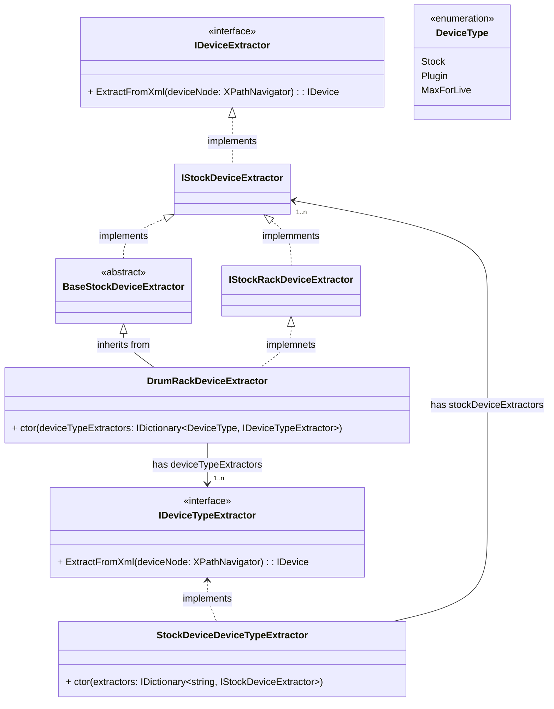

# Class diagram

```mermaid
classDiagram

%% Basic interfaces
IDeviceExtractor <|.. IStockDeviceExtractor : implements
IStockDeviceExtractor  <|.. IStockRackDeviceExtractor : implemments
IStockDeviceExtractor <|.. BaseStockDeviceExtractor : implements

%% DrumRackDeviceExtractor
BaseStockDeviceExtractor <|-- DrumRackDeviceExtractor : inherits from
IStockRackDeviceExtractor <|.. DrumRackDeviceExtractor : implemnets
DrumRackDeviceExtractor --> "1..n" IDeviceTypeExtractor : has deviceTypeExtractors

%% StockDeviceDeviceTypeExtractor
IDeviceTypeExtractor <.. StockDeviceDeviceTypeExtractor : implements
StockDeviceDeviceTypeExtractor --> "1..n" IStockDeviceExtractor : has stockDeviceExtractors


%% Class definitions

class BaseStockDeviceExtractor {
    <<abstract>>
}

class StockDeviceDeviceTypeExtractor {
    + ctor(extractors: IDictionary~string, IStockDeviceExtractor~ )
}

class DrumRackDeviceExtractor {
    + ctor(deviceTypeExtractors: IDictionary~DeviceType, IDeviceTypeExtractor~ )
}

class IDeviceExtractor {
    <<interface>>
    + ExtractFromXml(deviceNode: XPathNavigator): IDevice
}

class IDeviceTypeExtractor {
    <<interface>>
    + ExtractFromXml(deviceNode: XPathNavigator): IDevice
}

class DeviceType {
    <<enumeration>>
    Stock
    Plugin
    MaxForLive
}
```
