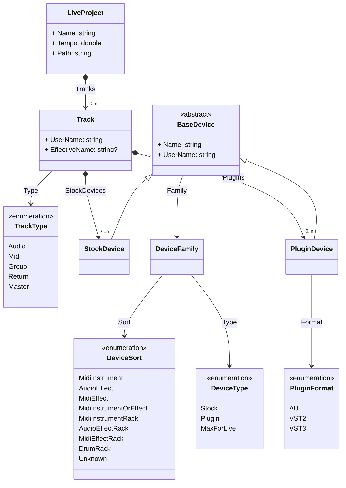

# Class diagram

```mermaid
classDiagram

%% Basic types definitions

class TrackType {
    <<enumeration>>
    Audio
    Midi
    Group
    Return
    Master
}

class PluginFormat {
    <<enumeration>>
    AU
    VST2
    VST3
}

class DeviceSort {
    <<enumeration>>
    MidiInstrument
    AudioEffect
    MidiEffect
    MidiInstrumentOrEffect
    MidiInstrumentRack
    AudioEffectRack
    MidiEffectRack
    DrumRack
    Unknown
}

class DeviceType {
    <<enumeration>>
    Stock
    Plugin
    MaxForLive
}

class BaseDevice {
    <<abstract>>
    + Name: string
    + UserName: string
}

%% Entities and Value Objects

class LiveProject {
    + Name: string
    + Tempo: double
    + Path: string
}

class Track {
    + UserName: string
    + EffectiveName: string?
}

%% Relationthips

BaseDevice <|-- StockDevice
BaseDevice <|-- PluginDevice
BaseDevice --> DeviceFamily : Family

LiveProject  *--> "0..n" Track : Tracks

Track  *--> "0..n" StockDevice : StockDevices
Track  *--> "0..n" PluginDevice : Plugins
Track  --> TrackType : Type

DeviceFamily --> DeviceSort : Sort
DeviceFamily --> DeviceType : Type

PluginDevice --> PluginFormat: Format
```
