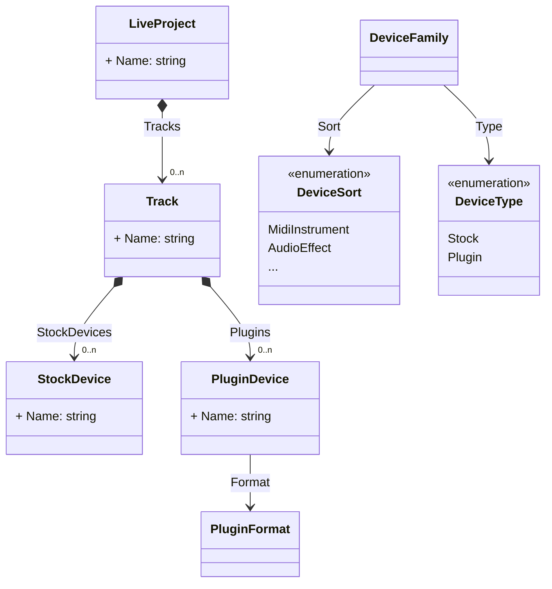

# Class diagram

```mermaid
classDiagram


%% Entities and Value Objects

class LiveProject {
    + Name: string
}

class Track {
    + Name: string
}

class StockDevice {
    + Name: string
}

class PluginDevice {
    + Name: string
}

class DeviceSort {
    <<enumeration>>
    MidiInstrument
    AudioEffect
    ...
}

class DeviceType {
    <<enumeration>>
    Stock
    Plugin
}


%% Relationthips

DeviceFamily --> DeviceSort : Sort
DeviceFamily --> DeviceType : Type

LiveProject  *--> "0..n" Track : Tracks

Track  *--> "0..n" StockDevice : StockDevices
Track  *--> "0..n" PluginDevice : Plugins

PluginDevice --> PluginFormat: Format
```
